# 💫 About Me:
👋 Hello there, I'm Joaquín 👨‍💻 I Love technology, and AI. 🎸 My second passion is the guitar and music. 

## 🌐 Socials:
 

## 🚀 Who am I?
Full Stack Developer with 4 years of experience and Founder that MixAI AI-powered platform for music automation.

### 🔥 Featured Projects

#### 🌳 The Reserve
3D multiplayer game to consientizar sobre el calentamiento global
- Built with Unity and Blender
- Focus: multiplayer system

#### 💧 Aqua Stark
Videogame to use web3 ecosystem
- Built with Unity and Blender
- Focus: Integration with starknet

#### 📃 Civis
Web site to votations
- Built with Starknet and Nextjs
- Focus: Integration with starknet

#### 💵 Money Mentor
Mobile App use to learn about money
- Built with React Native(expo) and nestjs
- Focus: Mobile app to learn

## 📚 Stack

### 🤖 AI / ML
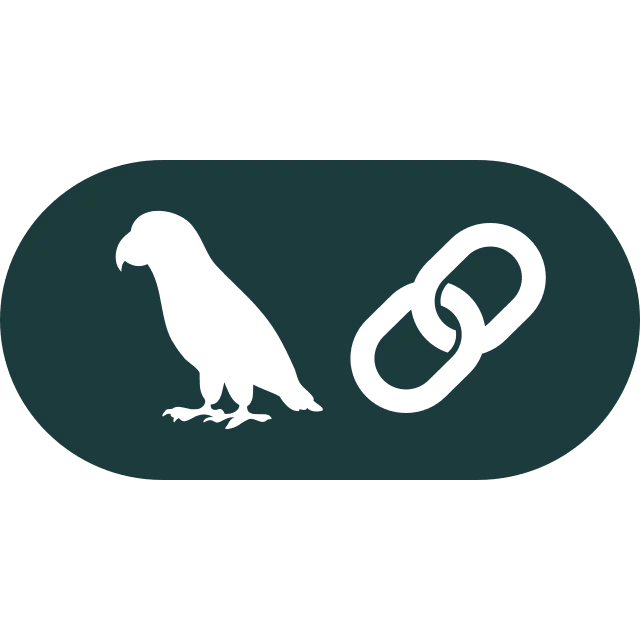 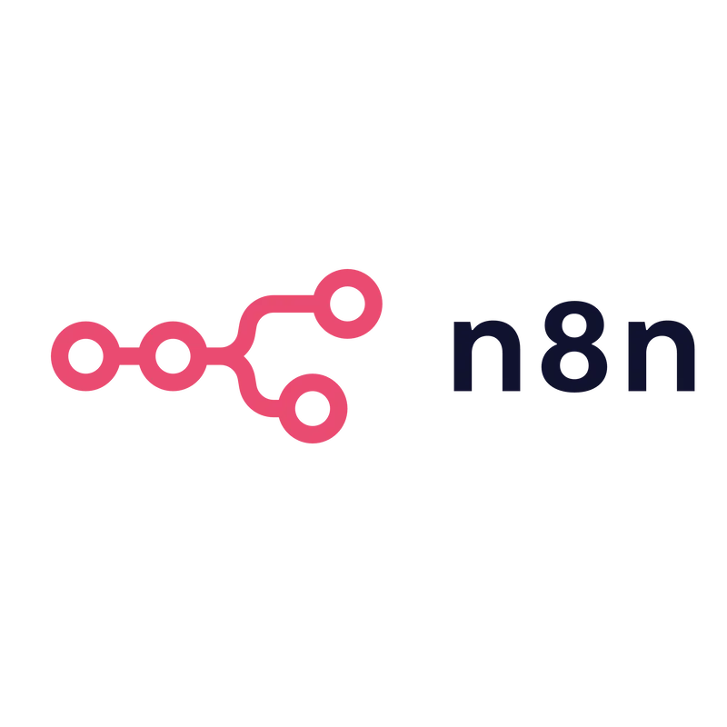  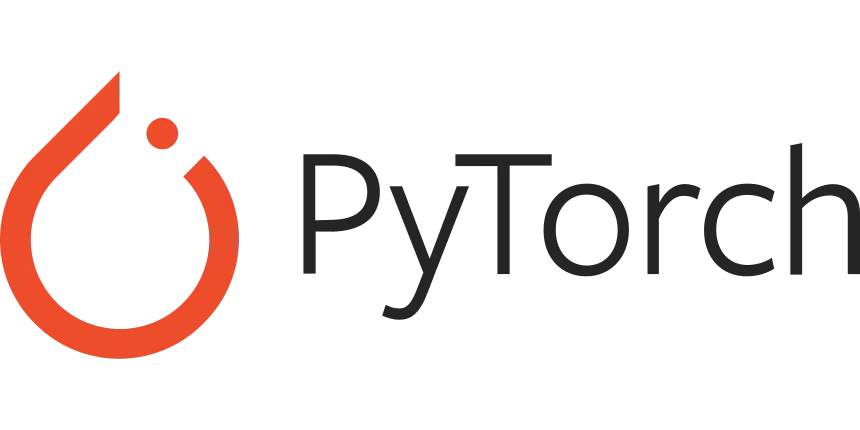 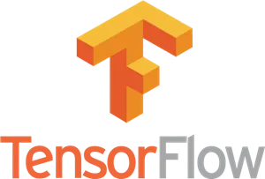

### 🖥️ Backend
 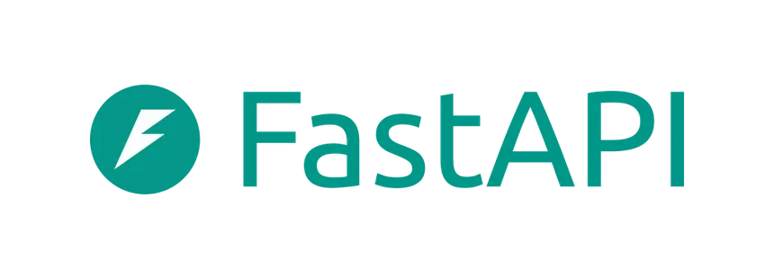 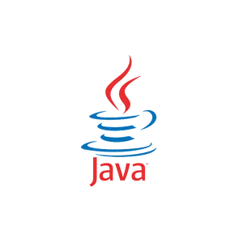 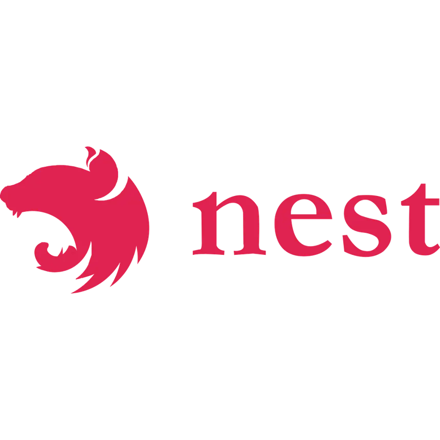 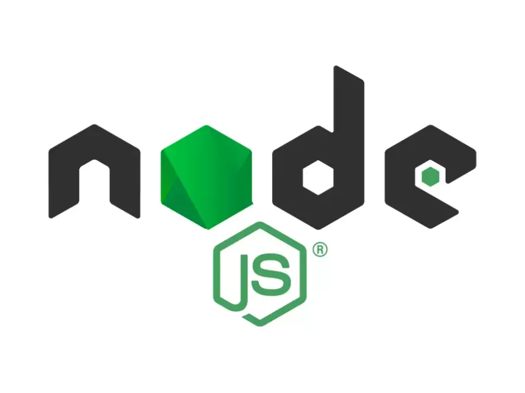 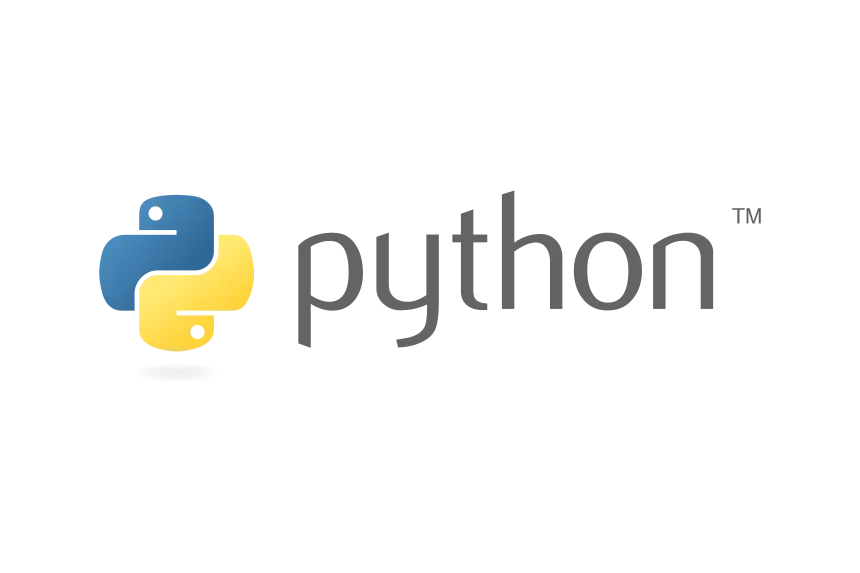 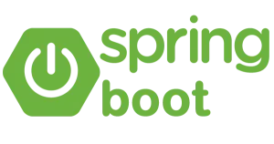 

### ⛓️ Blockchain
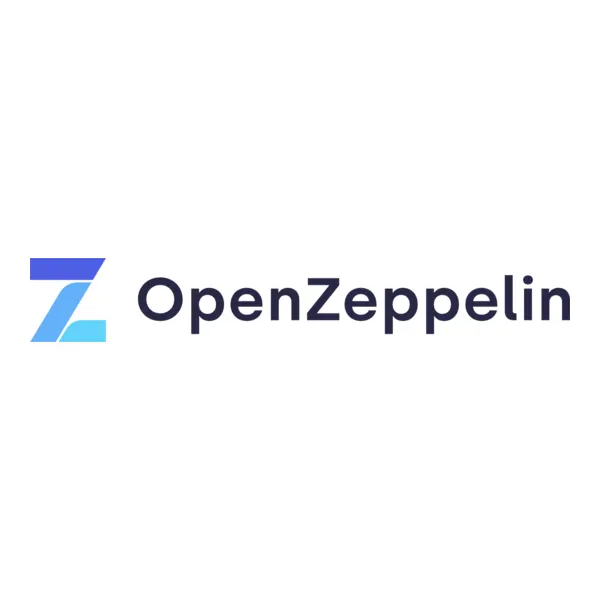  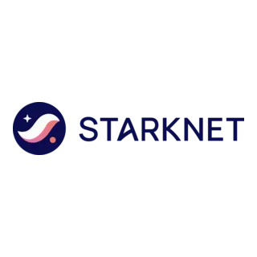 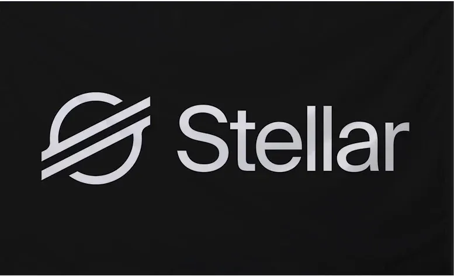

### 💻 Frontend / Web
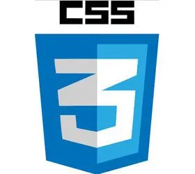 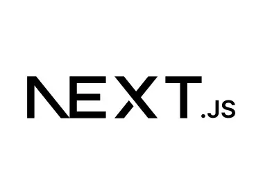  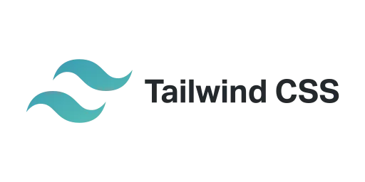

### 🚀 DevOps
 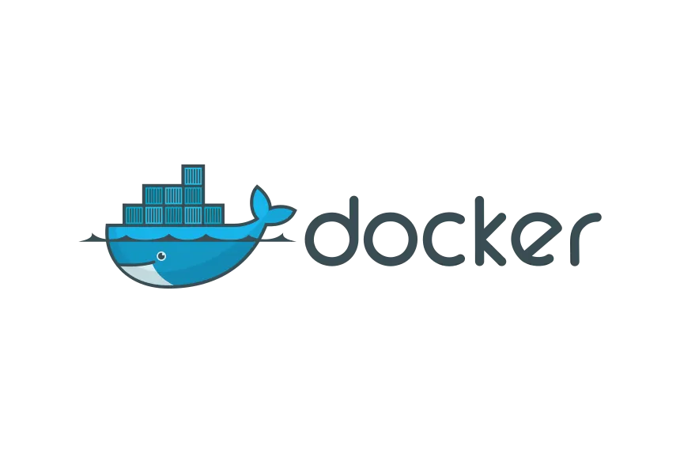 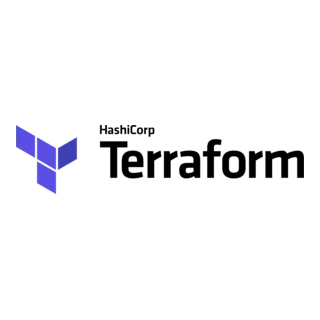

### 📱 Mobile
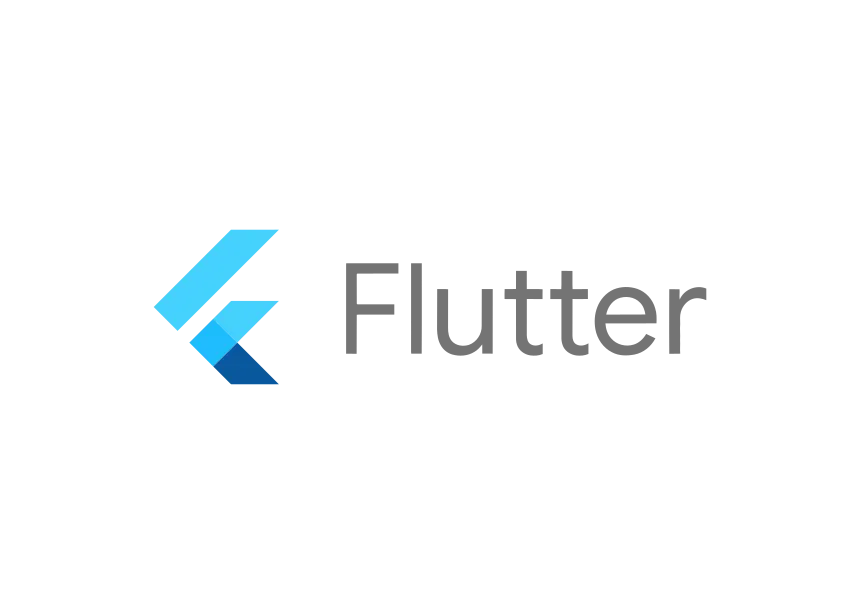 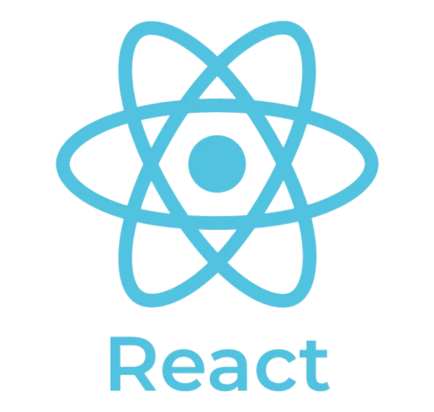

### 🌐 Networking

### 🎮 Video Games
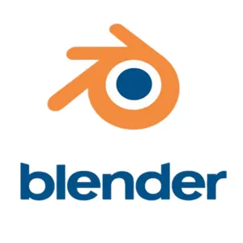 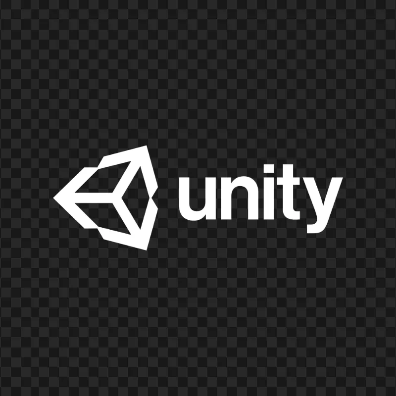

